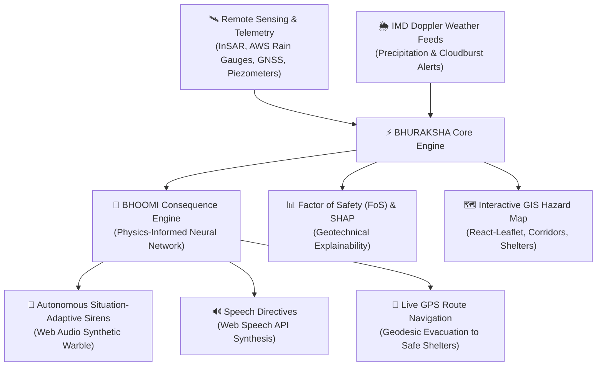

# BHURAKSHA (SEOC-NER)
## AI-Powered Landslide Early Warning & Geohazard Decision Support System for North Eastern India
### Developed for SIH26001 • Ministry of Development of North Eastern Region (MDoNER) & NDMA

---

## 1. Executive Summary

The North Eastern Region (NER) of India represents one of the world's most landslide-vulnerable geological terrains, characterized by steep Himalayan/Indo-Burman tectonic slopes, fragile sedimentary formations, and extreme monsoon precipitation. 

**BHURAKSHA** is an operational State Emergency Operations Centre (SEOC) intelligence platform that integrates:
1. **Multi-Source IoT & Space Telemetry**: AWS precipitation gauges, InSAR ground displacement rates, piezometric pore-water pressures, and IMD Doppler radar bulletins.
2. **Physics-Informed Nowcasting & SHAP Explainability**: Calibrated geotechnical failure thresholds ($I\text{-}D$ intensity-duration, infinite-slope Factor of Safety) combined with a gradient-boosted nowcasting ensemble.
3. **BHOOMI Predictive Consequence Engine**: Multi-task forward neural architecture modeling critical corridor severance hours, isolated population, infrastructure damage index, and time-to-failure (TTF).
4. **Autonomous Situation-Adaptive Alerts & Geodesic Navigation**: Browser-native emergency sirens (Web Audio API synthesis), voice directives (Web Speech API), and instant turn-by-turn routing to nearest DDMA designated safe shelters via Leaflet GIS mapping and Google Maps GPS routing.
5. **Zero-Backend Edge Resilience**: 100% client-side deterministic execution with zero cloud runtime dependencies or external API failure points, ensuring emergency command continuity during mountain optical fiber or telecommunication severance.

---

## 2. System Architecture



---

## 3. Key Modules

### A. BHOOMI Consequence Engine
- **Input Features**: 24h cumulative rainfall ($mm$), peak rainfall intensity ($mm/h$), antecedent soil moisture saturation ($\%$, volumetric), slope angle ($\theta^\circ$), GNSS displacement velocity ($mm/day$), historical slide frequency, population density, and catchment area ($km^2$).
- **Predicted Impact Metrics**:
  - **Road Corridor Closure Duration**: Predicted highway blockage time in hours ($0\text{--}72\text{ h}$).
  - **Severance Probability**: Probability of primary arterial supply route failure ($0\text{--}100\%$).
  - **Isolated Population**: Downstream/upstream headcount isolated by mass movement.
  - **Infrastructure Damage Index**: Composite rating of bridges, culverts, transmission towers, and residential structures at risk.
  - **Time-to-Failure (TTF)**: Estimated hours before critical slope shear plane slip.

### B. Geodesic Risk Exposure & Automated Navigation
- Evaluates real-time distance from the user's GPS coordinates to the nearest active hazard scarp using Haversine geodesic calculations.
- Identifies the closest designated DDMA emergency relief shelter with vehicle and on-foot ETAs.
- Renders dynamic hazard zones, road blockages, and an evacuation corridor overlay on the GIS map.
- Generates live GPS turn-by-turn route navigation directly to the safe zone.

### C. Multi-Role Operational Command Desks
Role-based access control supporting diverse administrative echelons:
- **NDMA / MDoNER Joint Cell**: Strategic multi-state resource mobilization and national sitrep generation.
- **District Disaster Authority (DDMA)**: Village evacuation mandates, highway diversion orders, and NDRF/SDRF deployment.
- **Field Engineers (BRO / PWD Slope Cell)**: Structural slope sensor calibration, wire-mesh/soil-nail telemetry, and heavy equipment dispatch.
- **Village Disaster Management Committees (VDMC)**: Local siren monitoring, vernacular voice advisories, and shelter management.

---

## 4. Local Installation & Development

### Prerequisites
- Node.js (v18.0.0 or higher)
- npm (v9.0.0 or higher)

### Setup & Launch

```bash
# 1. Clone repository & install dependencies
git clone https://github.com/your-username/bhuraksha.git
cd bhuraksha
npm install

# 2. Start development server
npm run dev

# 3. Build optimized production bundle
npm run build
```

---

## 5. Demonstration Credentials

| Role / Desk | Username | Password | Operational Focus |
| :--- | :--- | :--- | :--- |
| **NDMA / MDoNER Joint Cell** | `ndma` | `raksha2026` | Multi-State Overview, National Sitrep, High-Level Resource Deployment |
| **District Disaster Authority** | `district` | `raksha2026` | District Sector Triage, Evacuation Notices, NDRF Mobilization |
| **BRO / PWD Slope Cell** | `field` | `raksha2026` | Engineering Telemetry, Highway Passability, Heavy Earthmover Dispatch |
| **Village Disaster Committee** | `citizen` | `raksha2026` | Community Early Warning, Local Shelter Guidance, Offline Voice Directives |

---

## 6. Technology Stack

- **Framework**: React 19, TypeScript, Vite 8
- **Styling**: Tailwind CSS v4, IBM Plex Sans & IBM Plex Mono typography
- **GIS & Mapping**: Leaflet, React-Leaflet, OpenStreetMap / Carto Dark Tiles
- **Data Visualization**: Recharts (SHAP Feature Contributions, Radar Profiles, Multi-Hour Nowcast Curves)
- **Audio & Speech Engine**: Native Web Audio API (synthetic dual-oscillator disaster sirens) & Native Web Speech API
- **Document Generation**: jsPDF (automated executive SEOC sitrep report export)
- **Quality & Linting**: Oxlint, TypeScript strict type-checking
